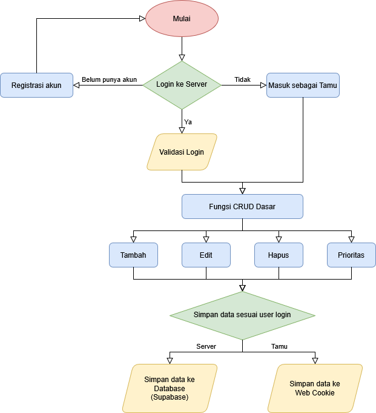

# 📝 Aplikasi Todo List Sederhana

Aplikasi web To-Do list yang simpel dan responsif dibangun menggunakan React dan Supabase. Memungkinkan pengguna mengelola tugas dengan fitur autentikasi dan penyimpanan data baik secara online maupun lokal (mode tamu).

## 🌐 Demo Aplikasi

Coba langsung aplikasinya di sini:
🔗 **[https://shoukelp.github.io/todo-app/](https://shoukelp.github.io/todo-app/)**

---

## ✨ Fitur Utama

- ✅ Tambah, edit, hapus, dan tandai tugas sebagai selesai/belum selesai.
- 🎨 Tetapkan prioritas tugas (High, Medium, Low) yang ditandai dengan warna.
- 🔍 Filter tugas berdasarkan status (Semua, Aktif, Selesai).
- ⇅ Urutkan tugas berdasarkan tanggal pembuatan (Terbaru/Terlama) atau abjad (A-Z/Z-A).
- 🔐 Opsi masuk yang fleksibel:
    - Google OAuth (Login cepat dengan akun Google).
    - Email & Password (Pendaftaran dan login manual).
    - Mode Tamu (Gunakan aplikasi tanpa login, data disimpan sementara di cookie browser).
- ☁️ Sinkronisasi otomatis ke database Supabase saat login, memastikan data aman dan tersedia di mana saja.
- 📱 Desain responsif untuk pengalaman yang baik di desktop maupun mobile.

---

## 🚀 Cara Penggunaan Aplikasi (User Guide)

1.  **Akses Aplikasi:** Buka [link demo](https://shoukelp.github.io/todo-app/) atau jalankan aplikasi secara lokal.
2.  **Pilih Metode Masuk:**
    * **Login dengan Google:** Klik tombol "Login with Google" untuk masuk menggunakan akun Google Anda.
    * **Login/Daftar dengan Email:** Masukkan email dan password. Klik "Sign In" jika sudah punya akun, atau klik link "Sign Up", isi detail, lalu klik "Sign Up" untuk mendaftar.
    * **Mode Tamu:** Klik tombol "Continue as Guest" untuk langsung menggunakan aplikasi. **Penting:** Data hanya disimpan di browser Anda (via cookie) dan akan hilang jika cookie dihapus atau pindah browser/perangkat.
3.  **Halaman Utama (Setelah Masuk/Mode Tamu):**
    * **Tambah Tugas:** Ketik nama tugas di input "Add new todo", pilih prioritas (High/Medium/Low) di dropdown sebelahnya, lalu klik tombol "Add".
    * **Filter & Urutkan:** Gunakan dropdown "Show:" untuk memfilter tugas (All, Active, Completed) dan dropdown "Sort By:" untuk mengurutkan daftar tugas.
    * **Daftar Tugas:** Menampilkan tugas Anda sesuai filter dan urutan yang dipilih.
    * **Tandai Selesai:** Klik kotak centang (checkbox) di sebelah kiri teks tugas. Teks akan dicoret. Klik lagi untuk menandai belum selesai.
    * **Prioritas:** Ikon berwarna di sebelah checkbox menunjukkan prioritas (🔴 High, 🟡 Medium, 🟢 Low, ⚪ Default/Medium).
    * **Edit Tugas:** Klik tombol "Edit" pada tugas yang diinginkan. Input teks dan dropdown prioritas akan muncul. Ubah sesuai kebutuhan, lalu klik "Save". Klik "Cancel" untuk membatalkan.
    * **Hapus Tugas:** Klik tombol "Delete" pada tugas yang ingin dihapus.
    * **Area Status:** Di bagian bawah daftar tugas, Anda akan melihat status login Anda (email atau "Guest Mode") dan pesan status operasi (misalnya "Todo added successfully").
    * **Keluar (Sign Out):** Jika Anda login (bukan mode tamu), akan ada link "Sign Out" di area status. Klik untuk keluar dari akun Anda.
    * **Kembali ke Login (Mode Tamu):** Jika Anda dalam mode tamu, akan ada link "Back to Login" di area status. Klik untuk kembali ke halaman login/daftar. **Catatan:** Data mode tamu *tidak* akan otomatis ditransfer ke akun Anda saat login.

---

## 📊 Struktur Data Kode

Aplikasi ini mengelola data menggunakan struktur berikut:

1.  **Array JavaScript (State `todos`):**
    * Struktur data utama yang menyimpan *kumpulan* To-Do item ada di dalam state `todos` pada komponen `App.js`. Ini adalah sebuah Array JavaScript (`[]`).
    * Semua operasi (tambah, update, hapus, filter, sort) berinteraksi dengan array ini.

2.  **Objek JavaScript (Item Todo Individual):**
    * Setiap elemen di dalam array `todos` adalah sebuah Objek JavaScript yang merepresentasikan satu tugas. Objek ini memiliki properti (pasangan kunci-nilai) seperti:
        * `id` (String/UUID): Pengenal unik tugas.
        * `text` (String): Deskripsi tugas.
        * `completed` (Boolean): Status selesai (`true`) atau belum (`false`).
        * `priority` (String): Prioritas ('High', 'Medium', 'Low').
        * `created_at` (String): Timestamp ISO 8601 kapan tugas dibuat.
        * `user_id` (String/UUID): ID pengguna Supabase yang memiliki tugas (hanya ada jika tidak dalam mode tamu).

3.  **Tipe Primitif Lainnya:**
    * **String:** Digunakan untuk teks, prioritas, ID, status, nilai filter/sortir, input form.
    * **Boolean:** Digunakan untuk status `completed`, `isEditing`, `isGuestMode`, `loading`.
    * **Null:** Digunakan untuk state `user` awal sebelum login.

4.  **JSON (JavaScript Object Notation):**
    * Digunakan secara implisit saat bertukar data dengan Supabase (API biasanya menggunakan format JSON).
    * Digunakan secara eksplisit (`JSON.stringify`, `JSON.parse`) untuk menyimpan dan membaca state `todos` dari *cookies* saat dalam Mode Tamu.

---

## 🎭 Skenario Penggunaan Aplikasi

Berikut beberapa contoh bagaimana pengguna dapat memanfaatkan aplikasi ini:

* **Mencoba Cepat Tanpa Akun:** Pengguna baru ingin segera mencatat beberapa ide. Ia memilih "Continue as Guest", menambahkan 3 tugas dengan prioritas berbeda. Nanti, jika ia merasa perlu menyimpan data ini secara permanen dan lintas perangkat, ia bisa memilih "Back to Login" dan mendaftar/masuk dengan akun Google atau Email.
* **Manajemen Tugas Harian:** Pengguna masuk dengan akun emailnya setiap pagi. Ia menambahkan tugas seperti "Balas email Klien X (High)", "Beli bahan makanan (Medium)", "Jadwal meeting tim (Medium)". Sepanjang hari, ia menandai tugas yang selesai dengan mencentang checkbox.
* **Fokus pada yang Belum Selesai:** Daftar tugas sudah panjang. Pengguna ingin fokus pada apa yang harus dikerjakan. Ia menggunakan filter "Show: Active" untuk menyembunyikan semua tugas yang sudah selesai.
* **Mencari Tugas Spesifik:** Pengguna ingat pernah menambahkan tugas tentang "laporan bulanan" tapi lupa detailnya. Ia mengurutkan berdasarkan "Sort By: Alphabetical (A-Z)" untuk mempermudah pencarian visual di daftar tugas.
* **Review Tugas Berdasarkan Prioritas:** Pengguna ingin mengerjakan tugas paling penting dulu. Meskipun tidak ada sort by priority, ia dapat secara visual mengidentifikasi tugas prioritas "High" (🔴) dengan mudah.
* **Mengedit Kesalahan:** Pengguna salah mengetik nama tugas. Ia klik "Edit", memperbaiki teksnya, lalu klik "Save".

---

## 🌳 Flowchart

Diagram alir dasar aplikasi:


Struktur Tabel Database (Supabase):


## 📁 Struktur Direktori

```
todo-app/
├── docs/
│   ├── flowchart.png
│   └── tables.png
├── public/
│   ├── favicon.ico
│   ├── index.html
│   ├── logo.png
│   ├── logo192.png
│   ├── logo512.png
│   ├── manifest.json
│   └── robots.txt
├── src/
│   ├── assets/
│   │   └── icons/
│   │       ├── auth-icon.svg
│   │       ├── google-icon.svg
│   │       └── guest-icon.svg
│   ├── components/
│   │   ├── Auth.js
│   │   ├── constants.js
│   │   ├── TodoForm.js
│   │   └── TodoItem.js
│   ├── hooks/
│   │   └── useAuth.js
│   ├── utils/
│   │   └── cookie.js
│   ├── App.css
│   ├── App.js
│   └── index.js
├── .env
├── .gitignore
├── LICENSE
├── package.json
├── package_lock.json
└── README.md
```

---

## ⚙️ Instalasi & Penggunaan Lokal

### 📌 Prasyarat

-   [Node.js & npm](https://nodejs.org/) (versi LTS direkomendasikan)
-   [Akun Supabase](https://supabase.com/) (Platform Backend-as-a-Service)
-   [Akun Google Cloud Console](https://console.cloud.google.com/) (Hanya jika ingin mengaktifkan Google OAuth)

---

### 🧪 1. Kloning Repositori

```bash
git clone [https://github.com/shoukelp/todo-app.git](https://github.com/shoukelp/todo-app.git)
cd todo-app
```

### 📦 2. Instalasi Dependensi
Bash

```bash
npm install
# atau jika menggunakan yarn:
# yarn install
```

### 🗄️ 3. Setup Supabase & Struktur Database

    Buat proyek baru di Supabase Dashboard.
    Pergi ke bagian SQL Editor di proyek Supabase Anda.
    Salin dan jalankan skrip SQL berikut untuk membuat tabel todos dan mengatur Row Level Security (RLS):

```SQL
CREATE TABLE IF NOT EXISTS public.todos (
    id UUID PRIMARY KEY DEFAULT gen_random_uuid(),
    user_id UUID REFERENCES auth.users(id) ON DELETE CASCADE, 
    text TEXT NOT NULL CHECK (char_length(text) > 0),
    completed BOOLEAN NOT NULL DEFAULT FALSE,
    priority TEXT NOT NULL DEFAULT 'Medium' CHECK (priority IN ('High', 'Medium', 'Low')),
    created_at TIMESTAMP WITH TIME ZONE NOT NULL DEFAULT NOW()
);

CREATE INDEX IF NOT EXISTS todos_user_id_idx ON public.todos (user_id);
CREATE INDEX IF NOT EXISTS todos_priority_idx ON public.todos (priority);

ALTER TABLE public.todos ENABLE ROW LEVEL SECURITY;

DROP POLICY IF EXISTS "Allow individual read access" ON public.todos;
CREATE POLICY "Allow individual read access"
ON public.todos
FOR SELECT
TO authenticated
USING (auth.uid() = user_id);

DROP POLICY IF EXISTS "Allow individual insert access" ON public.todos;
CREATE POLICY "Allow individual insert access"
ON public.todos
FOR INSERT
TO authenticated
WITH CHECK (auth.uid() = user_id);

DROP POLICY IF EXISTS "Allow individual update access" ON public.todos;
CREATE POLICY "Allow individual update access"
ON public.todos
FOR UPDATE
TO authenticated
USING (auth.uid() = user_id)
WITH CHECK (auth.uid() = user_id);

DROP POLICY IF EXISTS "Allow individual delete access" ON public.todos;
CREATE POLICY "Allow individual delete access"
ON public.todos
FOR DELETE
TO authenticated
USING (auth.uid() = user_id);
```

### 🔑 4. Setup Google OAuth (Opsional)

Jika Anda ingin menggunakan fitur login dengan Google:
#### a. Google Cloud Console

    Buka Google Cloud Console.
    Buat proyek baru atau pilih proyek yang sudah ada.
    Navigasi ke APIs & Services > Credentials.
    Klik + Create credentials > OAuth client ID.
    Pilih Web Application sebagai tipe aplikasi.
    Isi nama aplikasi (misal: "Todo App Dev").
    Tambahkan URI berikut:
        Authorized JavaScript origins:
            http://localhost:3000 (Untuk pengembangan lokal)
            https://<username_github>.github.io (Untuk versi deploy di GitHub Pages)
        Authorized redirect URIs:
            https://<SUPABASE_PROJECT_REF>.supabase.co/auth/v1/callback (Ganti <SUPABASE_PROJECT_REF> dengan ID unik proyek Supabase Anda. Bisa dilihat di URL dashboard Supabase atau di Settings > API). Ini adalah URI redirect standar Supabase. (Catatan: Beberapa tutorial mungkin menggunakan redirect ke aplikasi Anda, tapi Supabase merekomendasikan callback ke domain Supabase untuk keamanan)
    Klik Create. Salin Client ID dan Client Secret yang muncul.

#### b. Supabase Authentication

    Kembali ke dashboard Supabase proyek Anda.
    Navigasi ke Authentication > Providers.
    Temukan Google, klik untuk mengembangkannya.
    Aktifkan provider Google.
    Masukkan Client ID dan Client Secret yang Anda dapatkan dari Google Cloud Console.
    Pastikan Redirect URL yang tertera di Supabase (https://<PROJECT_REF>.supabase.co/auth/v1/callback) SAMA PERSIS dengan yang Anda masukkan di Google Cloud Console pada langkah 7 di atas.
    Klik Save.

### 🧾 5. Konfigurasi .env

    Di direktori root proyek Anda (todo-app/), buat file baru bernama .env.
    Salin URL Proyek dan Anon Key dari Supabase Dashboard (Settings > API).
    Isi file .env seperti berikut (ganti dengan nilai Anda):

Cuplikan kode

```
REACT_APP_SUPABASE_URL=https://<YOUR_PROJECT_REF>.supabase.co
REACT_APP_SUPABASE_ANON_KEY=<YOUR_SUPABASE_ANON_KEY>
```

Penting: Pastikan nama variabel (misal: REACT_APP_SUPABASE_URL) sesuai dengan yang digunakan di kode Anda (src/hooks/useAuth.js). Jika Anda menggunakan Vite (seperti dalam konfigurasi vite.config.js yang ada), prefix standarnya adalah VITE_. Jika Anda tetap menggunakan REACT_APP_ dengan Vite, pastikan konfigurasi Vite Anda mengenali prefix tersebut atau ubah kode untuk menggunakan VITE_. Mari kita asumsikan kode Anda sudah disesuaikan untuk REACT_APP_ atau Anda akan menyesuaikannya.

### 🚀 6. Menjalankan Aplikasi Lokal

Buka terminal di direktori todo-app/ dan jalankan:

```Bash
npm run dev
# atau jika menggunakan yarn:
# yarn dev
# atau jika masih menggunakan konfigurasi create-react-app:
# npm start
```

Aplikasi akan berjalan dan bisa diakses melalui http://localhost:3000 (atau port lain jika 3000 sudah terpakai).


### 📦 7. Deploy ke GitHub Pages (Contoh menggunakan Vite)

#### a. Install gh-pages

Dependensi ini membantu proses deployment ke branch gh-pages.

```Bash
npm install gh-pages --save-dev
# atau
# yarn add gh-pages --dev
```

#### b. Tambahkan script di package.json

Pastikan package.json Anda memiliki script berikut:

```JSON
{
  "name": "todo-app",
  "version": "0.1.0",
  "private": true,
  "homepage": "https://<USERNAME_GITHUB>.github.io/<NAMA_REPOSITORI>",
  "dependencies": {
    // dependensi lain
  },
  "scripts": {
    "start": "react-scripts start",
    "build": "react-scripts build",
    "test": "react-scripts test",
    "eject": "react-scripts eject",
    "predeploy": "npm run build",
    "deploy": "gh-pages -d build"
  },
  // konfigurasi lain (eslintConfig, browserslist, dll.)
}
```

Ganti <USERNAME_GITHUB> dan <NAMA_REPOSITORI> dengan username GitHub dan nama repositori Anda.

Ganti <NAMA_REPOSITORI> dengan nama repositori Anda (misal: /todo-app/).

#### c. Build & Deploy

Jalankan perintah berikut dari terminal di root proyek:

```Bash
npm run deploy
# atau
# yarn deploy
```

Perintah ini akan:

    Menjalankan npm run build (karena ada predeploy).
    Membuat build produksi di folder dist/.
    Menggunakan gh-pages untuk mendorong isi folder dist/ ke branch gh-pages di repositori GitHub Anda.

#### d. Aktifkan GitHub Pages

    Buka repositori Anda di GitHub.
    Pergi ke Settings > Pages.
    Di bagian Build and deployment, pilih Sumber (Source) sebagai Deploy from a branch.
    Pilih branch gh-pages dan folder / (root).
    Klik Save. Tunggu beberapa saat hingga GitHub selesai membangun dan men-deploy situs Anda. URL publik akan muncul di halaman ini.

#### e. Update URI di Google Console (Jika Perlu)

Pastikan Authorized JavaScript origins di Google Cloud Console (langkah 4a) mencakup URL GitHub Pages Anda: https://<username_github>.github.io. Authorized redirect URI seharusnya sudah benar jika Anda menggunakan callback Supabase (https://<PROJECT_REF>.supabase.co/auth/v1/callback).

## 🤝 Kontribusi

Kontribusi, isu, dan permintaan fitur sangat diterima!
Jika Anda ingin berkontribusi:

    Fork Repositori ini.
    Buat Branch baru (git checkout -b fitur/FiturBaru).
    Commit perubahan Anda (git commit -am 'Menambahkan FiturBaru').
    Push ke Branch (git push origin fitur/FiturBaru).
    Buat Pull Request baru.

## 📜 Lisensi

Didistribusikan di bawah Lisensi MIT. Lihat LICENSE untuk informasi lebih lanjut.

    📝 Catatan: Gantilah placeholder seperti <YOUR_PROJECT_REF>, REACT_APP_SUPABASE_URL, REACT_APP_SUPABASE_ANON_KEY, <username_github>, dan <NAMA_REPOSITORI> sesuai dengan konfigurasi proyek Anda. Pastikan prefix environment variable (REACT_APP_ atau VITE_) konsisten antara file .env dan penggunaannya di dalam kode.